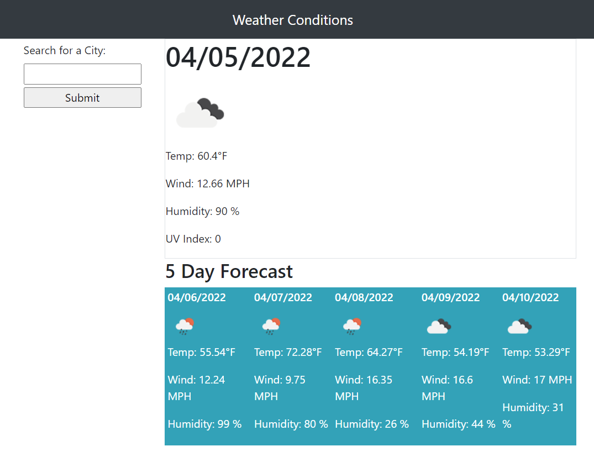

# Weather App Homework Assignment 6:

Tasked with creating a weather app that fetches current weather and forecasts from the OpenWeather API.

Users can type in a city of their choosing and receive accurate conditions and forecasts. Previous searches will be shown in a list below.

Information includes weather condition, temperature, humidity, wind speed, and current UV index.

SITE URL: https://sherb93.github.io/weather_app

